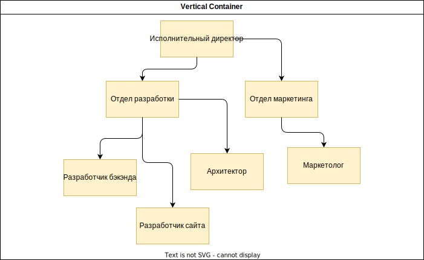
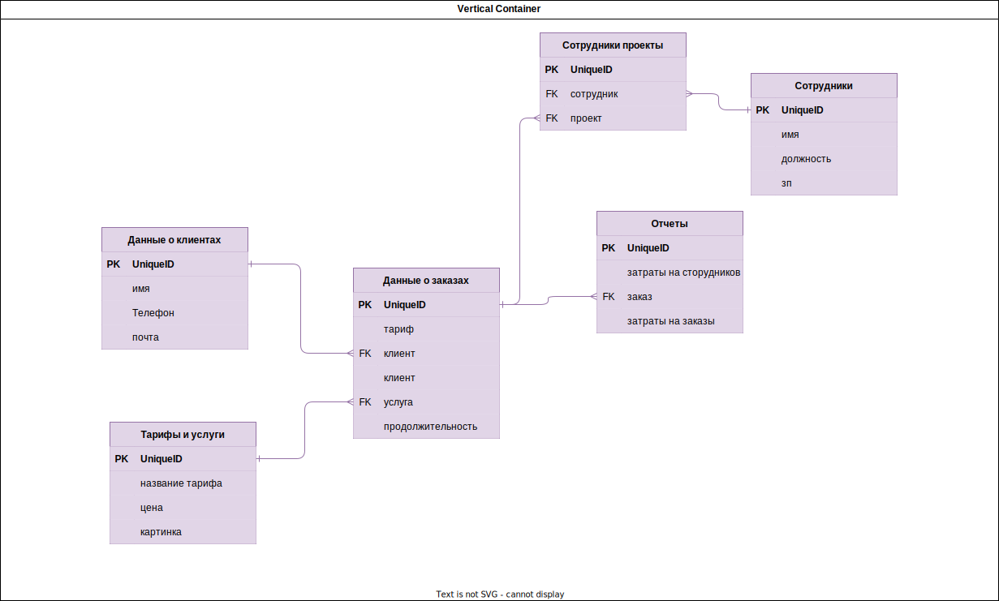
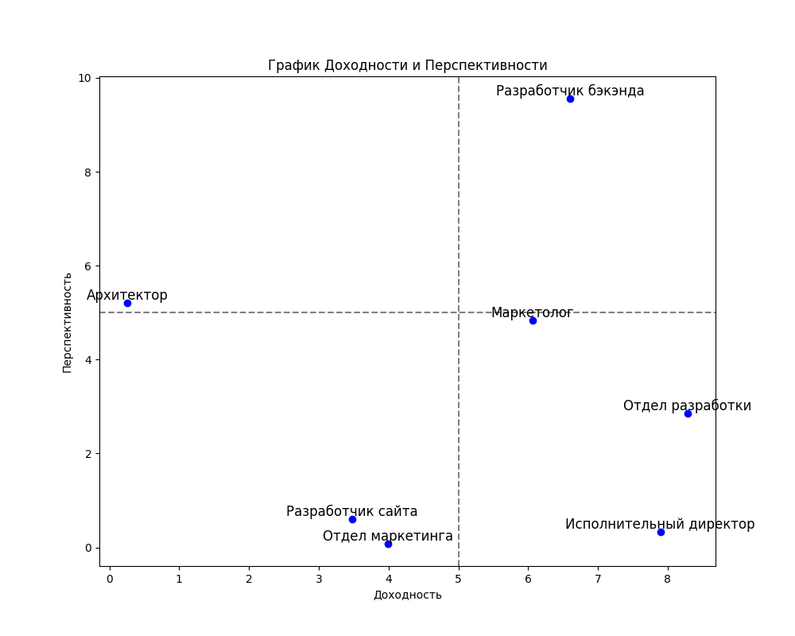
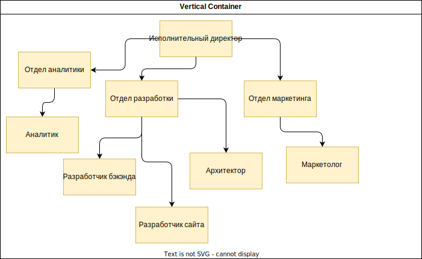
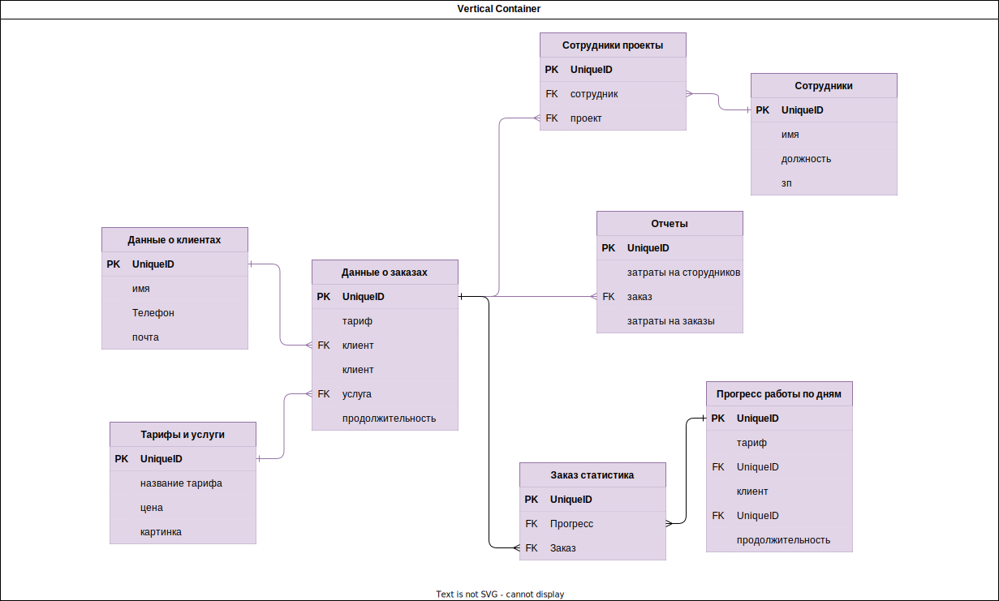

# Лабораторные работы

## 1 (ОРГАНИЗАЦИОННАЯ СТРУКТУРА AS-IS)

### **Моё решение**

## 2  (СТРУКТУРА БИЗНЕС-ПРОЦЕССОВ AS-IS)

### **Моё решение**

## 3 (ДИАГРАММА ПОТОКОВ ДАННЫХ AS-IS)

### **Моё решение**

## 4 (СТРУКТУРА БАЗЫ ДАННЫХ AS-IS)

### **Моё решение**

## 5 (ДИАГРАММА ПОКАЗАТАЛЕЙ)

### **Мой график**

## 6 (ОРГАНИЗАЦИОННАЯ СТРУКТУРА TO-BE)

### **Моё решение**

## 7 (СТРУКТУРА БИЗНЕС-ПРОЦЕССОВ TO-BE)

### **Моё решение**

## 8 (ДИАГРАММА ПОТОКОВ ДАННЫХ TO-BE)

### **Моё решение**

## 9 (СТРУКТУРА БАЗЫ ДАННЫХ TO-BE)

### **Моё решение**

# Lectures

[lec1](./lec/lec1.pdf)
[lec2](./lec/lec2.pdf)
[lec3](./lec/lec3.pdf)
[lec4](./lec/lec4.pdf)
[lec5](./lec/lec5.pdf)
[lec6](./lec/lec6.pdf)
[lec7](./lec/lec7.pdf)
[lec8](./lec/lec8.pdf)
[lec8.1](./lec/lec8.1.pdf)
[lec9](./lec/lec9.pdf)
[lec10](./lec/lec10.pdf)
[lec11](./lec/lec11.pdf)
[lec12](./lec/lec12.pdf)
[lec13](./lec/lec13.pdf)
[lec14](./lec/lec14.pdf)
[lec15](./lec/lec15.pdf)
[lec16](./lec/lec16.pdf)
[lec17](./lec/lec17.pdf)
[lec18](./lec/lec18.pdf)

